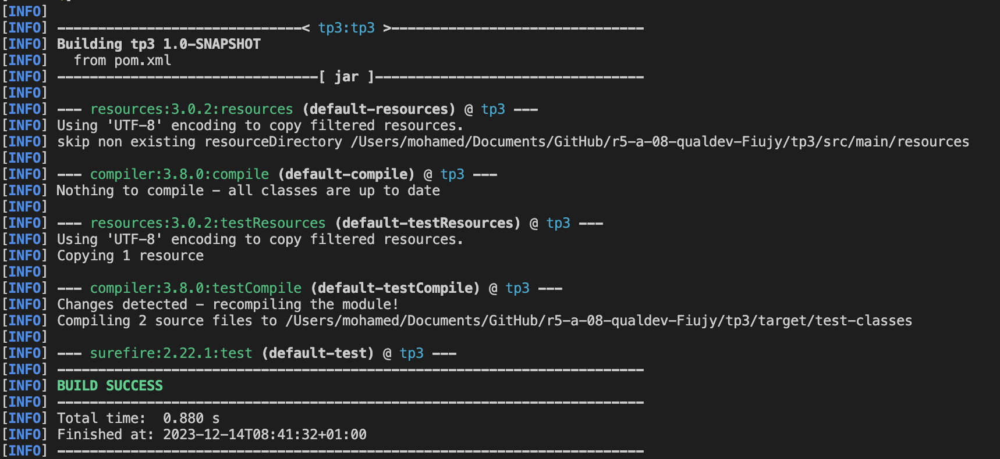
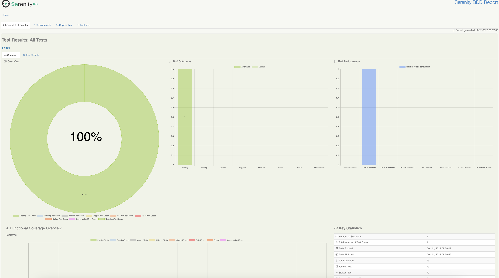

= R5.A.08 -- Dépôt pour les TPs
:icons: font
:MoSCoW: https://fr.wikipedia.org/wiki/M%C3%A9thode_MoSCoW[MoSCoW]

Ce dépôt concerne les rendus de mailto:A_changer@etu.univ-tlse2.fr[Jonh Doe].

== TP1

Feature: Is it Friday yet?
  Everybody wants to know when it's Friday

  Scenario: Sunday isn't Friday
    Given today is Sunday
    When I ask whether it's Friday yet
    Then I should be told "Nope"

  Scenario: Friday is Friday
    Given today is Friday
    When I ask whether it's Friday yet
    Then I should be told "TGIF"

.Image de l'éxecution du test du TP1

image::TP1_Tests_Success.png[width=80%]

== TP2

package dojo; 

import java.util.ArrayList;
import java.util.List;

public class Order {
    private String owner;
    private String target;
    private List<String> cocktails;

    public Order() {
        cocktails = new ArrayList<>();
    }

    public void declareOwner(String owner) {
        this.owner = owner;
    }

    public void declareTarget(String target) {
        this.target = target;
    }

    public void addCocktail(String cocktail) {
        cocktails.add(cocktail);
    }

    public List<String> getCocktails() {
        return cocktails;
    }
}

.Image de l'éxecution du test du TP2

image::TP2_Tests_Success.png[width=80%]

== TP3

Feature: Kratos Adventures

  As Kratos, the God of War
  I want to showcase my abilities
  So that I can conquer mythical challenges

  Scenario: Battle with a Mythical Creature
    Given Kratos is equipped with the "Blades of Chaos"
    When Kratos engages in a battle with the "Cerberus"
    Then Kratos should be able to defeat the "Cerberus"

  Scenario: Solving an Ancient Puzzle
    Given Kratos encounters an ancient puzzle
    When Kratos explores the environment
    Then Kratos should be able to solve the puzzle

  Scenario: Unleash Godly Powers
    Given Kratos faces a powerful enemy
    When Kratos uses his godly powers
    Then Kratos should be able to overpower the enemy

  Scenario: Journey through the Underworld
    Given Kratos ventures into the Underworld
    When Kratos navigates through treacherous landscapes
    Then Kratos should successfully reach the other side

Les tests : 

@Given("Kratos is equipped with the {string}")
    public void kratosIsEquippedWith(String weapon) {
        kratos = new Kratos("Kratos", weapon, 100);
    }

    @When("Kratos engages in a battle with {string}")
    public void kratosEngagesInABattleWith(String enemy) {
        kratos.engageInBattle(enemy);
        // Assuming a simple condition for success
        battleResult = enemy.equals("Cerberus");
    }

    @Then("Kratos should be able to defeat {string}")
    public void kratosShouldBeAbleToDefeat(String enemy) {
        Assert.assertTrue("Kratos should have defeated " + enemy, battleResult);
    }

    @When("Kratos explores the environment")
    public void kratosExploresTheEnvironment() {
        kratos.solvePuzzle("Ancient Puzzle");
        // Assume the puzzle is always solvable for simplicity
    }

    @When("Kratos uses his godly powers")
    public void kratosUsesHisGodlyPowers() {
        kratos.useGodlyPowers();
        // Assume the godly powers are always successful for simplicity
    }

    @Then("Kratos should successfully reach the other side")
    public void kratosShouldSuccessfullyReachTheOtherSide() {
        // Assuming a simple condition for success
        boolean reachedOtherSide = true;
        Assert.assertTrue("Kratos should have reached the other side", reachedOtherSide);
    }

.Image de l'éxecution du test du TP3

== TP4

include::report.txt[]

