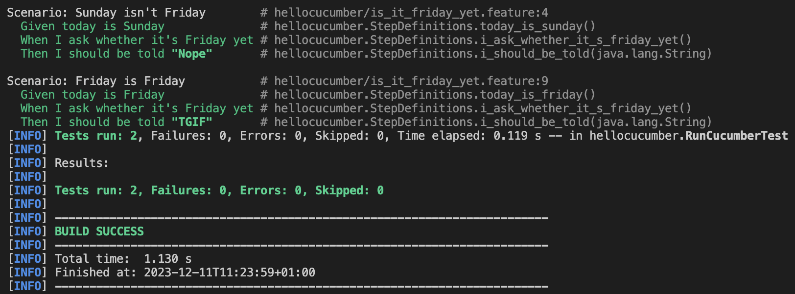
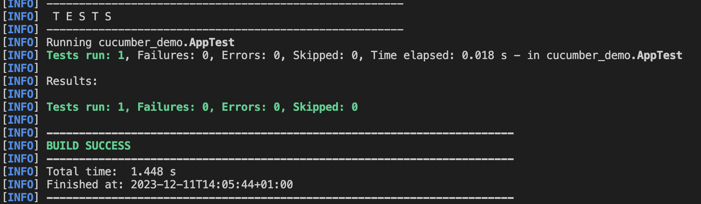

= R5.A.08 -- Dépôt pour les TPs
:icons: font
:MoSCoW: https://fr.wikipedia.org/wiki/M%C3%A9thode_MoSCoW[MoSCoW]

Ce dépôt concerne les rendus de mailto:A_changer@etu.univ-tlse2.fr[Jonh Doe].

== TP1

Feature: Is it Friday yet?
  Everybody wants to know when it's Friday

  Scenario: Sunday isn't Friday
    Given today is Sunday
    When I ask whether it's Friday yet
    Then I should be told "Nope"

  Scenario: Friday is Friday
    Given today is Friday
    When I ask whether it's Friday yet
    Then I should be told "TGIF"

.Image de l'éxecution du test du TP1

== TP2

package dojo; 

import java.util.ArrayList;
import java.util.List;

public class Order {
    private String owner;
    private String target;
    private List<String> cocktails;

    public Order() {
        cocktails = new ArrayList<>();
    }

    public void declareOwner(String owner) {
        this.owner = owner;
    }

    public void declareTarget(String target) {
        this.target = target;
    }

    public void addCocktail(String cocktail) {
        cocktails.add(cocktail);
    }

    public List<String> getCocktails() {
        return cocktails;
    }
}

.Image de l'éxecution du test du TP2

